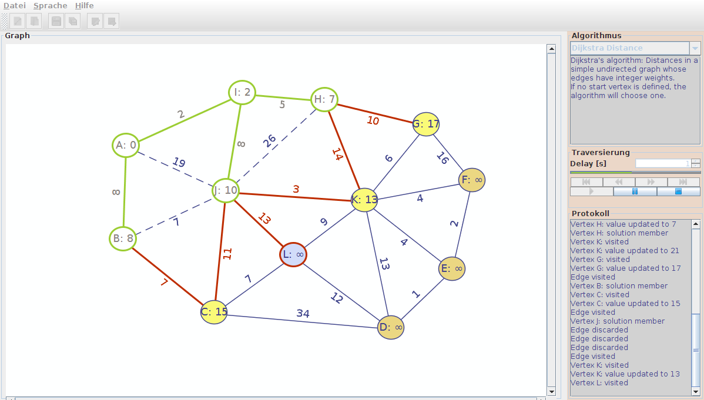

### vistra - Visualisierung von Graphenalgorithmen
Desktop-Applikation zur Visualisierung von Graphenalgorithmen, Implementation unter Berücksichtigung von Design Principles und Design Pattern.

- Algorithmen: Depth-first search DFS, Breadth-first search BFS, Dijkstra, Kruskal. 
- Methoden: Objektorientierte Programmierung OOP, Objektorientierte Analyse und Design OOAD. 
- Technologie: Oracle Java, Eclipse-Projekt mit Apache Maven und Ant, Java Swing UI-Framework, Apache Commons IO, net.datastructures, Java Universal Network/Graph Framework JUNG, GraphML. 

- <a target="_blank" href="https://www.hashdoc.com/documents/476943/desktop-applikation-zur-visualisierung-von-graphenalgorithmen">Bericht</a>
- <a target="_blank" href="https://youtu.be/PHCs4vWJ0Cw">Screencast</a>
- [Executable](GraphVisualisierung2/release-demo/vistra.jar?raw=true)
- [Demo-Graph](GraphVisualisierung2/release-demo/simple-undirected-weigthed_with_start.vistra?raw=true).

### Lösung
#### Framework, implemetiert OOAD Design Pattern:
 - Graph: [Factory](GraphVisualisierung2/src/main/java/vistra/framework/graph/GraphFactory.java), [Manager](GraphVisualisierung2/src/main/java/vistra/framework/graph/GraphManager.java), [Adapter](GraphVisualisierung2/src/main/java/vistra/framework/graph/ITraversableGraph.java), [State / Command combined](GraphVisualisierung2/src/main/java/vistra/framework/graph/item/state/)
 - Algorithm: [Manager and Strategy](GraphVisualisierung2/src/main/java/vistra/framework/algorithm/IAlgorithmManager.java)
 - Traversal: [Macro Command](GraphVisualisierung2/src/main/java/vistra/framework/traversal/step/)
 
#### Applikation:
 - Implementiert als [Zustandsmaschine](GraphVisualisierung2/src/main/java/vistra/app/control/state/)
 - Algorithmen: BFS, [DFS](GraphVisualisierung2/src/main/java/vistra/framework/algorithm/impl/DFS.java), [Dijkstra](GraphVisualisierung2/src/main/java/vistra/framework/algorithm/impl/Dijkstra.java), Kruskal

Modul Projekt 1, Semesterarbeit HS 2013/14.

Berner Fachhochschule, Abteilung Technik und Informatik BFH-TI, Biel/Bienne.
