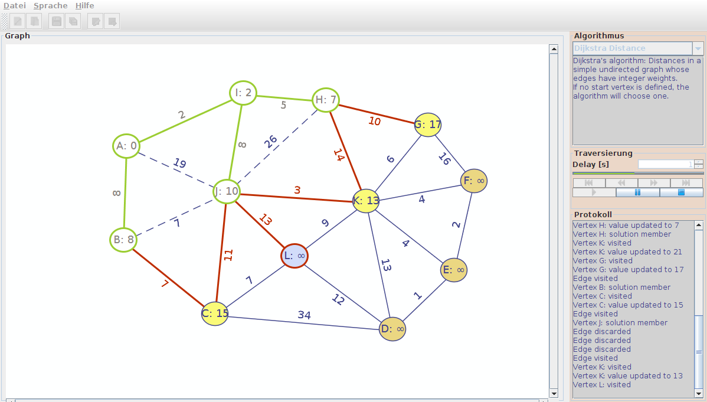

# VISTRA &mdash; Desktop-Applikation zur Visualisierung von Graphenalgorithmen

Framework und Applikation zur Visualisierung von Algorithmen und Datenstrukturen implementiert unter Berücksichtigung von Design Principles und Design Pattern der Objektorientierten Analyse und Design OOAD sowie unter Anwendung der Objektorientierten Programmierung.

* [Screencast](https://youtu.be/PHCs4vWJ0Cw) auf Youtube
* [Bericht](https://www.slideshare.net/RolandBruggmann/desktopapp-zur-visualisierung-von-graphenalgorithmen) auf SlideShare

*Fig. 1.: GUI der Desktop-Applikation VISTRA: Graph-Editor mit Farb- und Signatur-codierter Visualisierung, Auswahl von Algorithmen, Traversierung als Step-Player und Ausgabe von Kommentaren im Protokoll-Bereich*

## Lösung

Features:

* Graph-Editor mit Farb- und Signatur-codierter Visualisierung
* Auswahl von Algorithmen: Tiefensuche (Depth-first Search DFS), ~~Breitensuche (Breadth-first Search BFS)~~, Kürzester Pfad (Dijkstra), ~~Minimaler Spannbaum (Kruskal)~~
* Traversierung als Step-Player
* Ausgabe von Kommentaren im Protokoll-Bereich

Framework:

* Package Graph, implemetiert Design Pattern [Factory](GraphVisualisierung2/src/main/java/vistra/framework/graph/GraphFactory.java), [Manager](GraphVisualisierung2/src/main/java/vistra/framework/graph/GraphManager.java), [Adapter](GraphVisualisierung2/src/main/java/vistra/framework/graph/ITraversableGraph.java), [State / Command combined](GraphVisualisierung2/src/main/java/vistra/framework/graph/item/state/)
* Package Algorithm, implemetiert Design Pattern [Manager and Strategy](GraphVisualisierung2/src/main/java/vistra/framework/algorithm/IAlgorithmManager.java)
* Package Traversal, implemetiert Design Pattern [Macro Command](GraphVisualisierung2/src/main/java/vistra/framework/traversal/step/)

Applikation:

* Implementiert als [Zustandsmaschine](GraphVisualisierung2/src/main/java/vistra/app/control/state/)
* Algorithmen: BFS, [DFS](GraphVisualisierung2/src/main/java/vistra/framework/algorithm/impl/DFS.java), [Dijkstra](GraphVisualisierung2/src/main/java/vistra/framework/algorithm/impl/Dijkstra.java), Kruskal

Technologie:

* Oracle Java
* Eclipse-Projekt mit Apache Maven und Ant
* Java Swing UI-Framework
* Apache Commons IO
* [net.datastructures](https://cs.brown.edu/cgc/net.datastructures.net/home.html) (cp. *Data Structures and Algorithms in Java (5th Edition)* by Michael Goodrich and Roberto Tamassia)
* [Java Universal Network/Graph Framework JUNG](https://github.com/jrtom/jung)
* [GraphML File Format](http://graphml.graphdrawing.org/)

---

Modul *"Projekt 1"*, Semesterarbeit HS 2013/14.

Berner Fachhochschule, Abteilung Technik und Informatik BFH-TI, Biel/Bienne.
