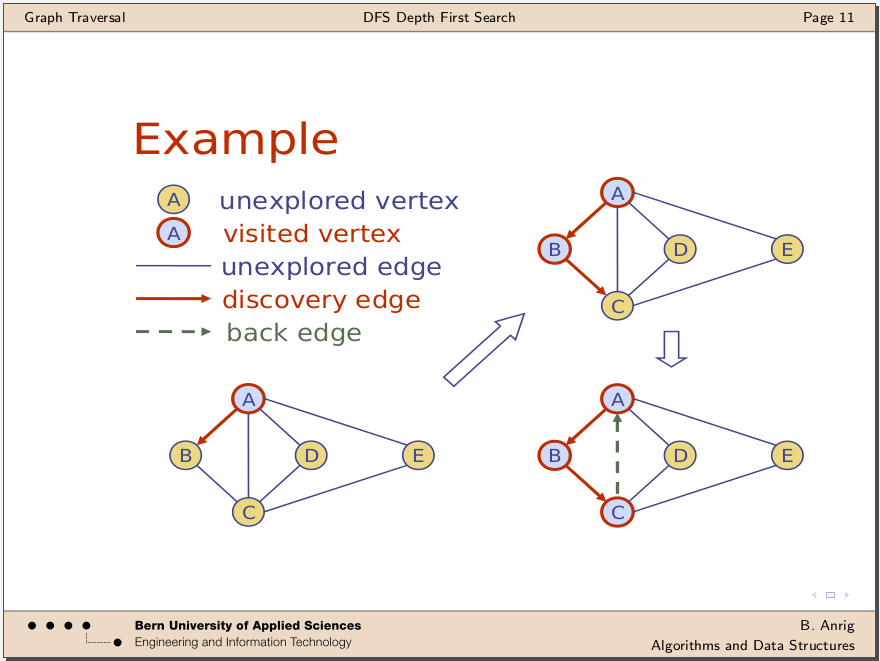
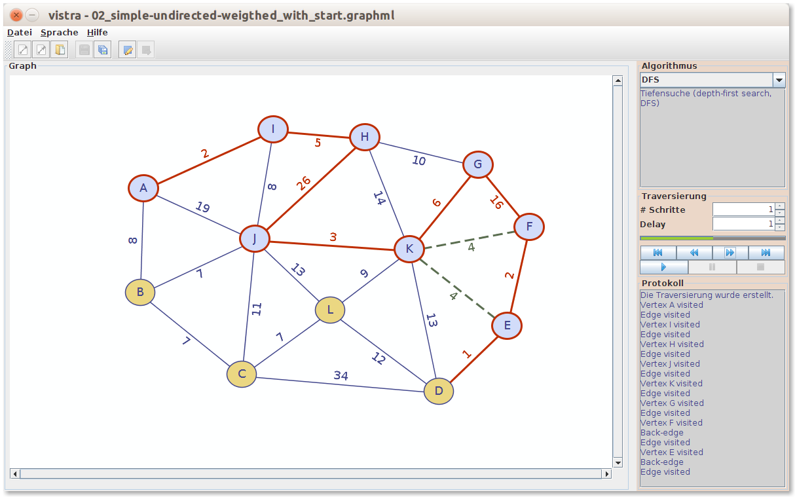

# Visualisierte Traversierung von Graphen
### Implementation von Algorithmen und Datenstrukturen

#### Semesterarbeit

Modul Projekt 1 
Berner Fachhochschule für Technik und Informatik BFH-TI, Biel/Bienne 2013/14

#### Beschreibung
Java-Applikation zum editieren und traversieren von Graphen.

##### Problem
Visualisierung der Algorithmen und Datenstrukturen
- gemäss Unterlagen im Modul 'Algorithms and Data structures'
- 'Look-and-feel' wie in den Unterlagen von net.datastructures

##### Lösung

#### Stichworte
- Algorithmen: BFS, [DFS](GraphVisualisierung2/src/main/java/vistra/framework/algorithm/impl/DFS.java), [Dijkstra](GraphVisualisierung2/src/main/java/vistra/framework/algorithm/impl/Dijkstra.java), Kruskal
- Datenstrukturen: un-/gerichteter, un-/gewichteter einfacher Graph (no self loops, no parallel edges)
- [Framework](GraphVisualisierung2/src/main/java/vistra/framework/) implemetiert OOAD Design Pattern: [Factory](GraphVisualisierung2/src/main/java/vistra/framework/graph/GraphFactory.java), [State](GraphVisualisierung2/src/main/java/vistra/framework/graph/item/state/), [Strategy](GraphVisualisierung2/src/main/java/vistra/framework/algorithm/IAlgorithmManager.java), [Command](GraphVisualisierung2/src/main/java/vistra/framework/traversal/step/), [Delegate](GraphVisualisierung2/src/main/java/vistra/framework/graph/ITraversableGraph.java)
- [MVC-App](GraphVisualisierung2/src/main/java/vistra/app/) mit Java-Observer-Pattern, implementiert als [Zustandsmaschine](GraphVisualisierung2/src/main/java/vistra/app/control/state/)
- Objekt-orientierte Programmierung in Java
- Eclipse-Projekt mit Apache Maven
- GUI mit Swing
- Dateiformat *.vistra in GraphML

#### Bibliotheken
- <a target="_blank" href="http://net3.datastructures.net/">net.datastructures</a>
- <a target="_blank" href="http://jung.sourceforge.net/">JUNG - Java Universal Network/Graph Framework</a>
- <a target="_blank" href="http://commons.apache.org/proper/commons-io/">Apache Commons IO</a>
- <a target="_blank" href="http://graphml.graphdrawing.org/">The GraphML File Format</a>

#### Downloads
- Release 1.0: [vistra-1.0.jar](GraphVisualisierung2/release-demo/vistra-1.0.jar?raw=true)
- <a target="_blank" href="https://speakerdeck.com/brugr9/visualisierte-traversierung-von-graphen-bericht">Bericht</a> (auf speakerdeck)
